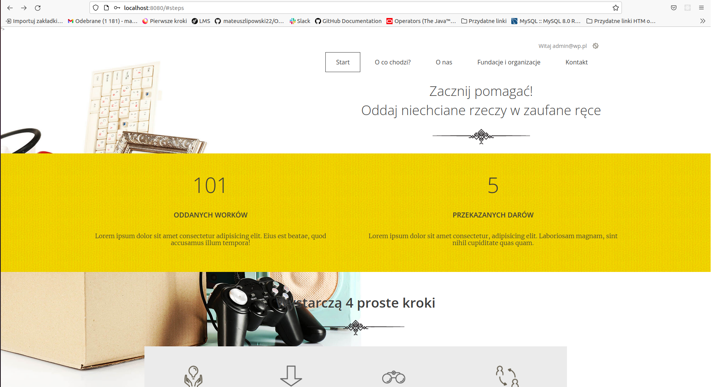
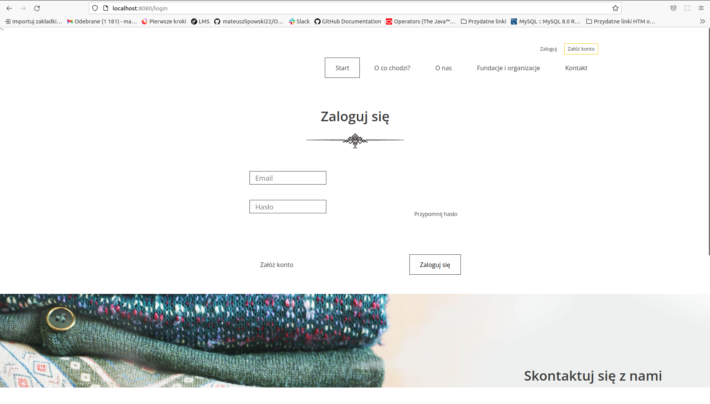
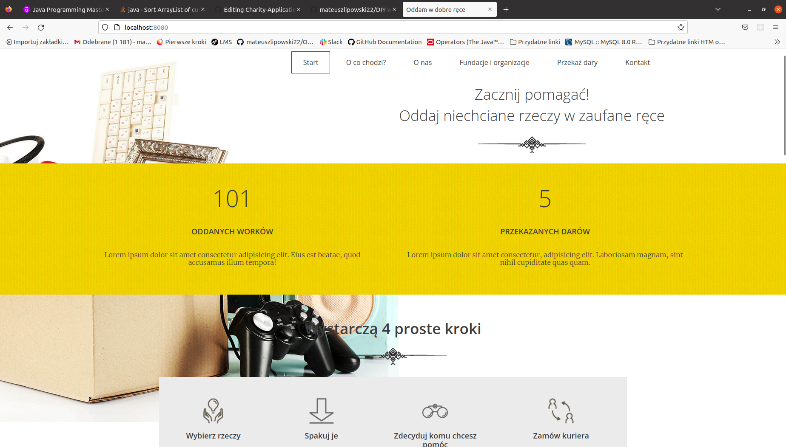
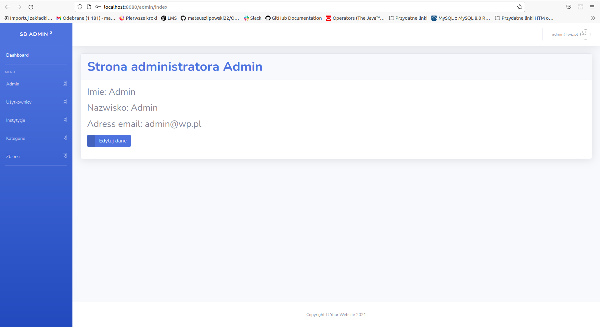
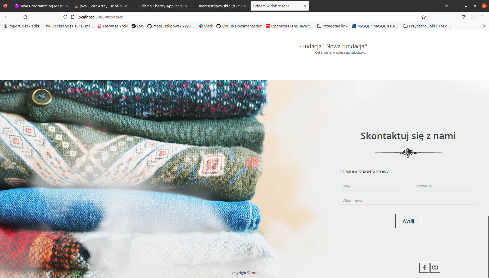
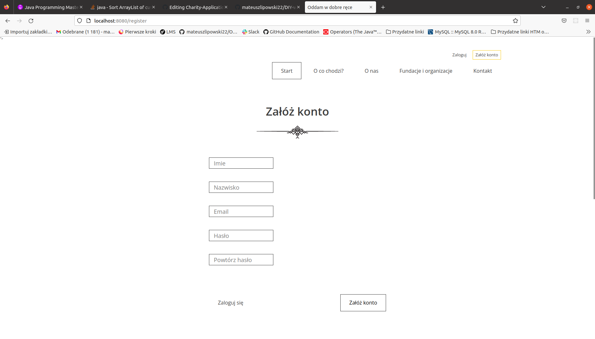

Charity donation application with usage of Spring

Web application for charity donation for particular foundation.

Application written in Spring framework uses following modules:
-MVC
-Security
-JPA
-Mail

Communication with MySQL database by the usage of Hibernate.

Front-end based on given HTML template with JavaScript - main website and SB admin 2 for admin panel

Simplification of the written JAVA code by the usage of Project Lombok.

Web application for charity donation

Website has two user roles:

User account:

Admin account:

Functionality of contact by contact form

Registration form with mail activation

